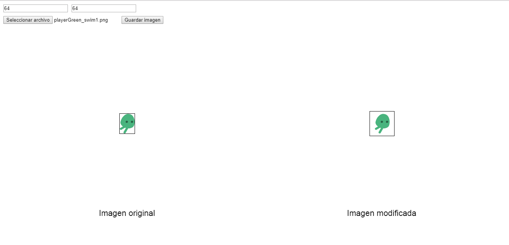
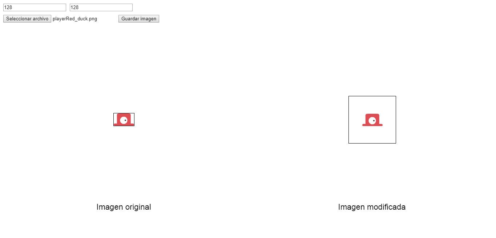

Este programa sencillo hecho con p5.js permite "redimensionar" y centrar imagenes, esta pensado para aumentar el tamaño de sprites pequeños para videojuegos con estilo pixel art, no para utilizarse con imagenes "grandes".

- Link para ver el proyecto: https://shadic78.github.io/Sprite-resizer-and-centering/

---

**Screenshots**

